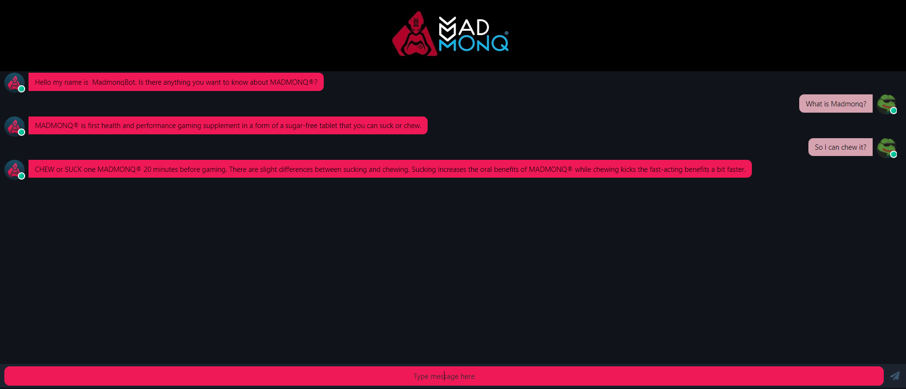

# Dialogflow-chatbot

[](https://www.javascript.com)
[](https://nodejs.org/en/)
[](https://expressjs.com)
[](https://dialogflow.cloud.google.com)
[](https://sass-lang.com)
[](https://reactjs.org)
[](https://mobx.js.org/README.html)

Chatbot with UI and dialogflow usage

Chat application in themes of MADMONQ®. Chat aplication connects to chatbot that is design and trained in Dialogflow ES as a FAQ chatbot for MADMONQ®.



## Instalation

Install all dependencies.
If you wish to connect it to your Dialogflow agent you need to specify your own
PROJECT_ID in .env file.
You will also need to generate recommender-key.json to connect to your google project that your DialogFlow agent is connected to. If you dont know how to do take a look at this <a href="https://cloud.google.com/iam/docs/creating-managing-service-account-keys"> Service key</a>

Key used in this project will expire in March 2022.

## Running

To run this app just type

```
npm start
```

in both client and backend folder.

App is not yet production ready.

<p align="center">
<a href="https://www.uhk.cz/cs/fakulta-informatiky-a-managementu/fim">

</a>
</p>
